Sistema de gestión de tickets desarrollado con Java y Spring Boot.


## 🟩 Sobre el proyecto

El proyecto ha sido creado con el objetivo de aprender el uso de **Spring Boot** y **Maven**.

Durante el desarrollo he trabajado con:

- Arquitectura REST en capas
- Uso de DTOs para desacoplar la API
- Validación de datos de entrada
- Manejo global de excepciones
- Persistencia de datos con JPA
- Documentación automática con OpenAPI (Swagger)


## 🟩 Tecnologías utilizadas

- Java 17  
- Spring Boot 3  
- Spring Web (REST)  
- Spring Data JPA  
- Bean Validation  
- PostgreSQL  
- Swagger / OpenAPI (springdoc)  
- Maven  
- Lombok  

## 🟩 Arquitectura

El proyecto sigue una **arquitectura en capas**:

- **Controller** → Manejo de peticiones HTTP  
- **Service** → Lógica de negocio  
- **Repository** → Acceso a datos  
- **DTOs** → Transferencia segura de datos  
- **Global Exception Handler** → Manejo centralizado de errores  

## 🟩 Funcionalidades

- Crear tickets de soporte  
- Obtener todos los tickets  
- Obtener un ticket por ID  
- Actualizar un ticket completo  
- Actualizar solo el estado del ticket  
- Eliminar tickets  
- Validación de datos de entrada  
- Manejo global de errores  
- Documentación automática con Swagger  

## 🟩 Endpoints principales

| Método | Endpoint | Descripción |
|------|---------|------------|
| GET | `/api/tickets` | Obtener todos los tickets |
| GET | `/api/tickets/{id}` | Obtener ticket por ID |
| POST | `/api/tickets` | Crear un nuevo ticket |
| PUT | `/api/tickets/{id}` | Actualizar un ticket completo |
| PATCH | `/api/tickets/{id}/status` | Actualizar estado del ticket |
| DELETE | `/api/tickets/{id}` | Eliminar un ticket |

---

## 🟩 Cómo ejecutar el proyecto
### ➡️​ Requisitos

- [Java 17](https://www.oracle.com/java/technologies/javase/jdk17-archive-downloads.html)
- Maven
- [PostgreSQL](https://www.postgresql.org/)


### ➡️​ Pasos
- git clone https://github.com/JJHernan-dev/ticket-management-backend.git
- cd ticket-management-backend
- mvn spring-boot:run

### ➡️​ Configuración

Hay que configurar las Environment Variables desde el IDE.

| Variable | Descripción | Ejemplo |
|---|---|---|
| `DB_URL` | URL de conexión a la base de datos PostgreSQL | `jdbc:postgresql://localhost:5432/ticket_management` |
| `DB_USERNAME` | Usuario de PostgreSQL | `postgres` |
| `DB_PASSWORD` | Contraseña del usuario de PostgreSQL | `la que tengas en PostgreSQL` |

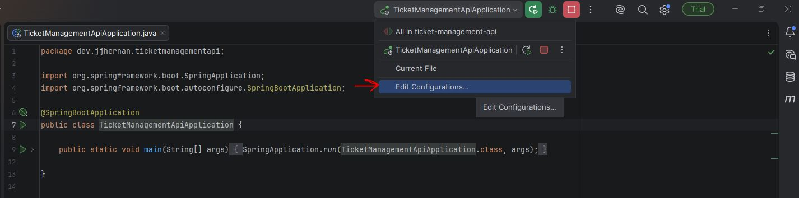
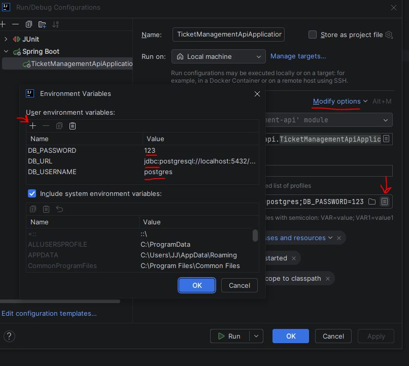

Importante crear la base de datos.

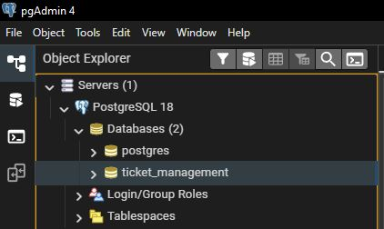

---

## 🟩 Ejemplos de uso de la API

A continuación se muestran algunos ejemplos de las operaciones principales disponibles en la API. <br>
Se muestran 2 imágenes por cada request, la primera imágen usando la extensión EchoApi y la segunda imágen usando Swagger UI.

- [EchoApi](https://marketplace.visualstudio.com/items?itemName=EchoAPI.echoapi-for-vscode)
- [Swagger UI](http://localhost:8080/swagger-ui/index.html#/)


### 🟦 Crear un ticket

####  Request

**POST** `http://localhost:8080/api/tickets`

```json
{
  "title": "Error al iniciar sesión",
  "description": "El usuario no puede acceder a la aplicación",
  "status": "OPEN"
}
```

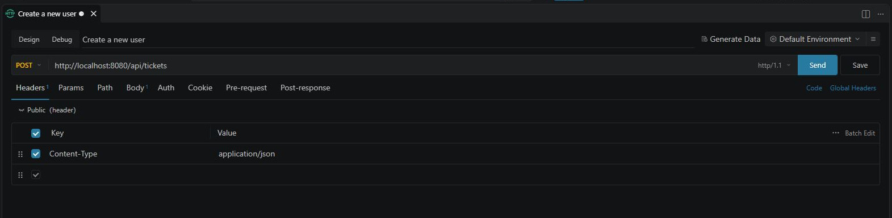
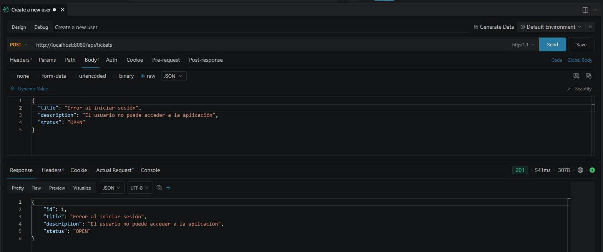
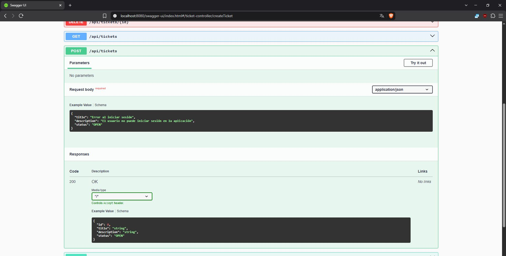

### 🟦 Obtener todos los tickets

####  Request

**GET** `http://localhost:8080/api/tickets`

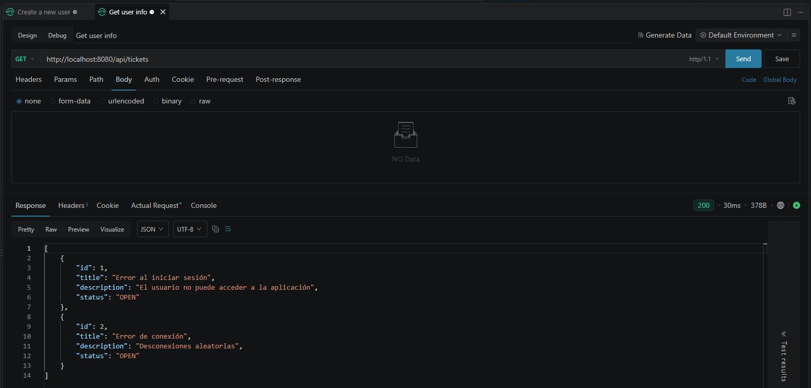
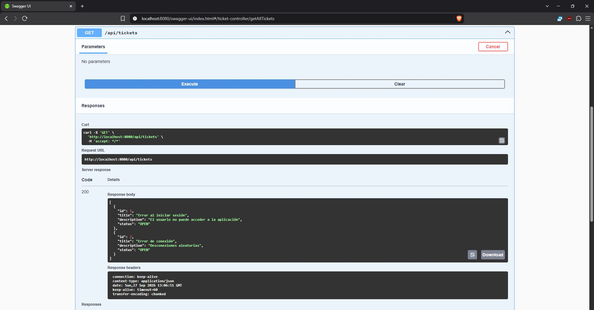

### 🟦 Obtener un ticket por ID

####  Request

**GET** `http://localhost:8080/api/tickets`

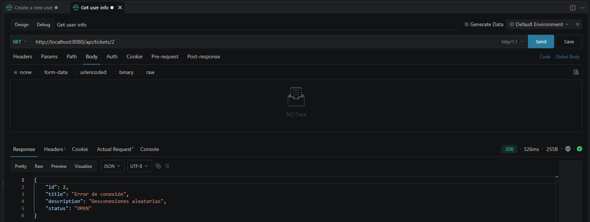
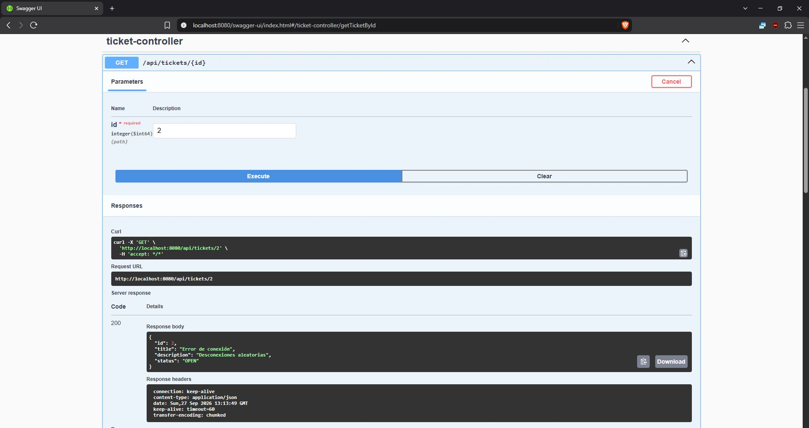

### 🟦 Actualizar un ticket

####  Request

**PUT** `http://localhost:8080/api/tickets`

```json
{ 
	"title": "Error al iniciar sesión", 
	"description": "El problema continúa después de restablecer la contraseña", 
	"status": "IN_PROGRESS" 
}
```

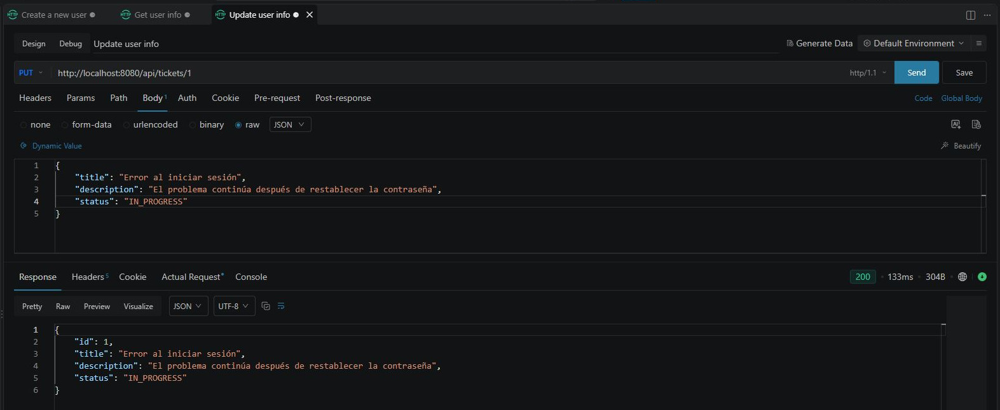
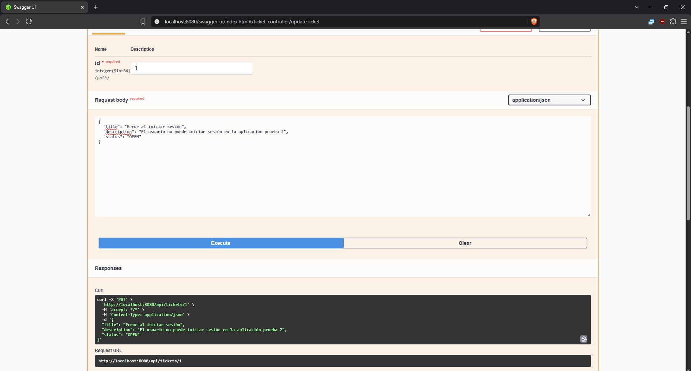

### 🟦 Actualizar el estado de un ticket

Lista de estados permitidos: OPEN, IN_PROGRESS y CLOSED.

####  Request

**PATCH** `http://localhost:8080/api/tickets`

```json
{
  "status": "CLOSED"
}
```

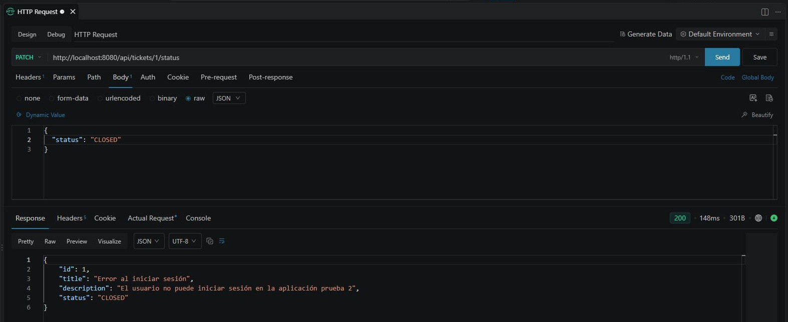
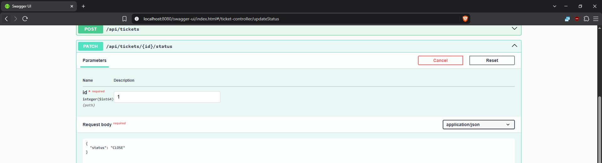

### 🟦 Eliminar un ticket

####  Request

**DELETE** `http://localhost:8080/api/tickets/2`

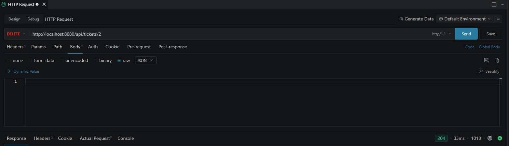
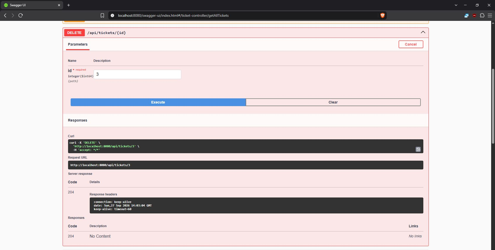

## 🟥 Ejemplos de errores

La API utiliza un manejo global de excepciones para devolver respuestas consistentes cuando ocurre un error.

###  🟦 Ticket no encontrado

**GET** `http://localhost:8080/api/tickets/999`

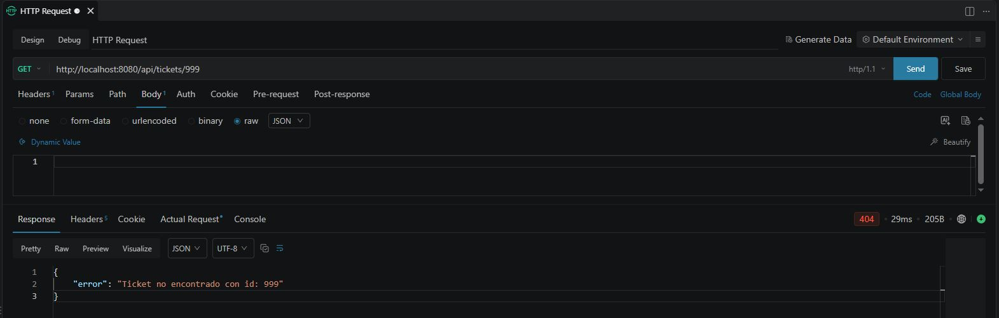

###  🟦 Error de validación

**POST** `http://localhost:8080/api/tickets`

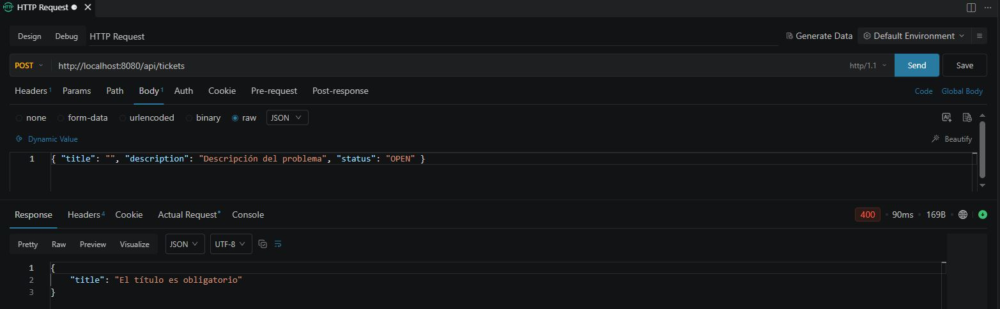

## 👨‍💻 Autor

Proyecto desarrollado por Juan Jesús González Hernández
